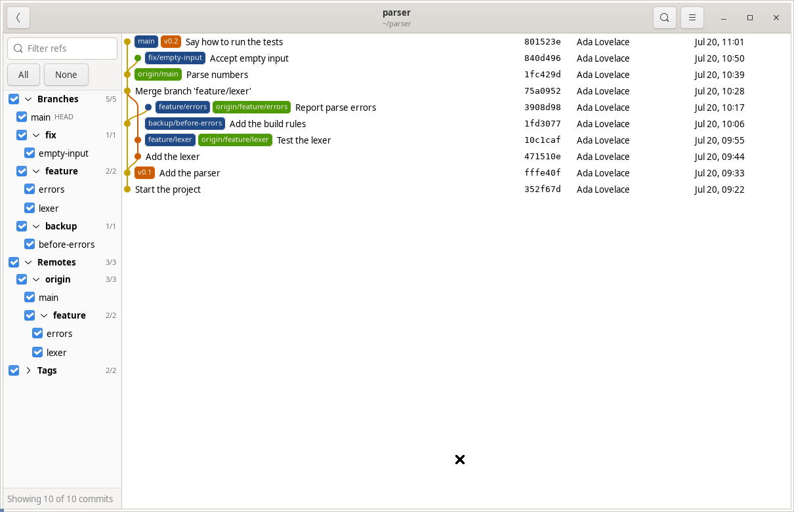
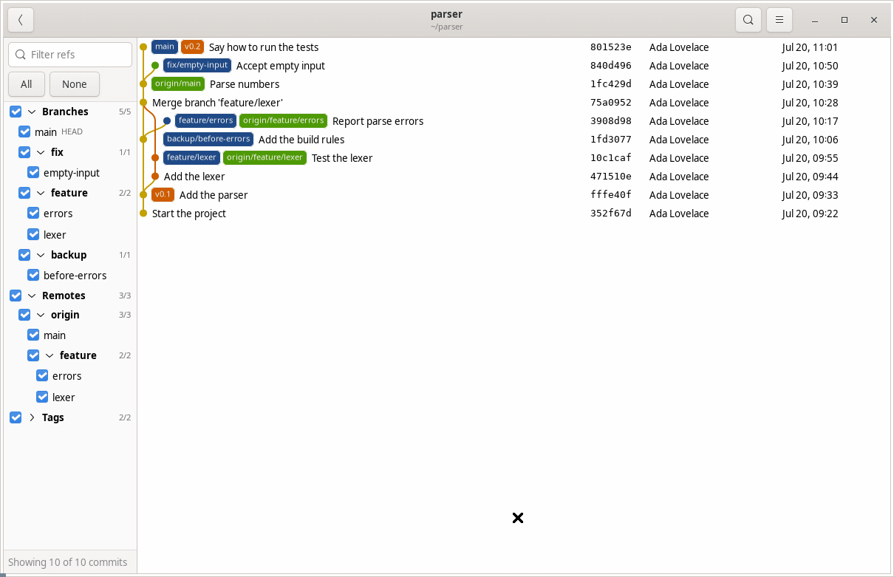

# `gitrl-f`

> The git history only of the refs that you want to see

`gitrl-f` is a stripped-down version of `gitg`. It shows the history of the branches, remote branches and tags that you tick, and nothing else. It draws that history as gitg does, with the same lanes, labels and diff.

> [!TIP]
> gitrl-f is pronounced git-ROL-EFF, after ctrl-f said aloud: control eff.



## What it does

- **A checkbox for each ref.** The panel on the left lists each branch, remote branch and tag, grouped by the slashes in their names.
- **Your ticks come back.** With no ref and no tick option on the command line, gitrl-f ticks the refs that you last chose in that repository.
- **The details on a click.** A click on a commit shows gitg's details and diff of that commit below the history. Escape hides them.


- **One search bar.** The search button at the top opens one bar above the list. Three buttons on its left pick what it searches: **Messages** (messages, authors and hashes), **Changed lines**, as `git log -S` and `git log -G` do, or **Files**. The matches are in bold, and **Display matches only** hides the other commits. When only unticked refs hold a match, **Tick and show** ticks one of those refs and selects the match.



- **Find in the diff.** While the pane is open, Ctrl+F opens a find bar that marks every match in every file of the commit, folded files too.
- **The history of lines.** A right click on lines of the diff offers to show only the commits that changed them, as `git log -L` does.
- **Where a commit is.** A right click on a commit shows its branches and tags, its first tag, and the merge that brought it into the branch of HEAD.
- **It follows the repository.** A commit, a fetch, a checkout or a rebase in another terminal redraws the window, with the same ticks and the same commit selected.

`gitrl-f` is built from `gitg`. It uses the language of gitg (Vala) and the same libraries, and the graph, the labels and the diff are gitg's own code.

## Installation

### From Launchpad

The PPA is for Ubuntu 24.04 and 26.04:

```bash
sudo add-apt-repository ppa:li9i/gitrl-f
sudo apt-get install gitrl-f
```

The package is `gitrl-f`. The command is `gitrlf`. In bash, TAB completes its options, then the names of the refs, and after `--` the paths.

### `.deb` package

Packages for Ubuntu 24.04 and 26.04 are on the [releases page](https://github.com/li9i/gitrl-f/releases). Download the one for your release, then install it with `apt`, so that you also get its dependencies:

```bash
sudo apt-get install ./gitrl-f_*_amd64.deb
```

### AppImage

Download the AppImage from the [releases page](https://github.com/li9i/gitrl-f/releases). It is one file, and it is not necessary to install it. Make it executable, then run it from a repository:

```bash
chmod +x gitrl-f-*-x86_64.AppImage
./gitrl-f-*-x86_64.AppImage
```

If your machine has no FUSE, run it unpacked. This needs no other software:

```bash
./gitrl-f-*-x86_64.AppImage --appimage-extract-and-run
```

To call it as `gitrlf` from any directory, link it into `~/.local/bin`, from the folder that holds it:

```bash
ln -s "$PWD"/gitrl-f-*-x86_64.AppImage ~/.local/bin/gitrlf
```

The AppImage has no TAB completion. The package and a build from source have it.

## Build from source

```bash
git clone https://github.com/li9i/gitrl-f.git
cd gitrl-f
```

`CONTRIBUTING.md` gives the packages that the build needs.

### For one user

```bash
meson setup --prefix="$HOME/.local" _build
meson install -C _build
```

The install puts `gitrlf` in `~/.local/bin`, which must be on the `PATH`. GLib and bash find the settings schema and the TAB completion with no more configuration.

### `.deb` package

This needs Docker. Each package builds in a container of its Ubuntu release, so that it links the libraries of that release:

```bash
./scripts/build-deb.sh 24.04
./scripts/build-deb.sh 26.04
```

The packages go to `_build/deb/`. Install one with `apt`, so that you also get its dependencies:

```bash
sudo apt-get remove --purge gitrl-f
sudo apt-get install ./_build/deb/gitrl-f_*~ubuntu24.04.1_amd64.deb
```

### AppImage

```bash
./scripts/build-appimage.sh
```

The AppImage goes to the top of the repository, as `gitrl-f-<version>-x86_64.AppImage`.

## How to run it

In a repository:

```bash
gitrlf                          # the ticks you chose last, or every ref
gitrlf main origin/main         # only these two
gitrlf 'feature/*'              # every ref whose name matches
gitrlf -l -r                    # every local and every remote branch
gitrlf -- src/parser.py         # only the commits that change this file,
                                # followed through its renames
gitrlf -S 'parse_args'          # only the commits that add or remove this text
gitrlf -S 'parse_args' -- src/parser.py
                                # the same, in this file only
gitrlf -G 'parse_[a-z]+'        # only the commits whose changed lines match
```

Outside a repository, `gitrlf` opens a list of the repositories that you opened before. `gitrlf -h` prints every option and key, and `man gitrlf` gives the whole of it.

| Key | What it does |
|-----|--------------|
| Click, `Enter` in the list | Shows or hides the details and the diff of a commit |
| `Escape` | Closes one thing, from the bottom of the window up |
| `Ctrl+F` | Opens the find bar of the diff, or the search bar when the pane is shut |
| `Ctrl+Shift+F` | Opens the search bar on **Changed lines** |
| `Enter`, `Ctrl+G`, `Shift+Enter`, `Ctrl+Shift+G` | Goes to the next match, or with `Shift` to the one before |
| `F5` | Reads the repository again |
| `Ctrl+Q` | Quits |

## Licence

GPL-2.0-or-later, from gitg. Refer to `COPYING`. `debian/copyright` gives the data for each file, with the credit to the authors of gitg. The icon is an adaptation of the Git logo by Jason Long, CC BY 3.0.
